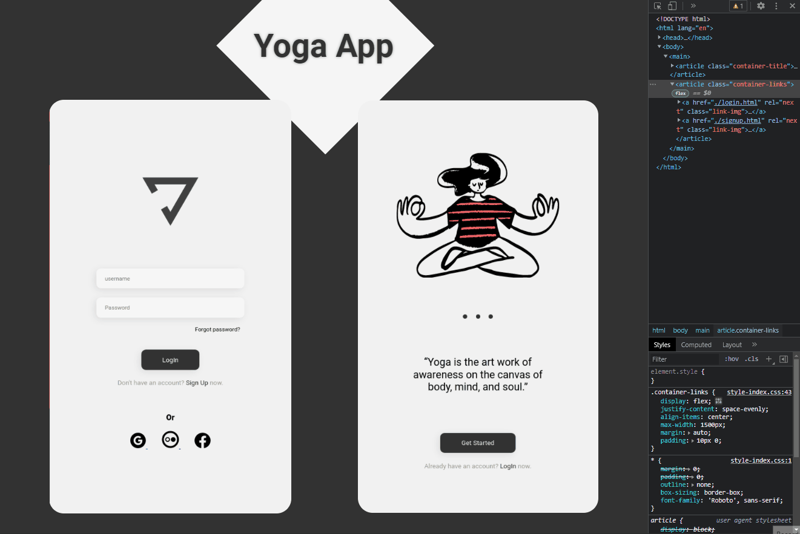

# Yoga App

## About
YogaApp was a <DevClub/> challenge created with HTML and CSS in which I made some improvements.
I made the LogIn and SignUp pages as requested. But I also decided to make an intro page, a basic navigation system between pages, and I added some animations.

## Result

  

Access the project <a href="https://luk4x.github.io/DevClub-project-YogaApp/">HERE</a>

## Contributors Contact
<table>
  <tr>
    <td align="center">
      <a href="https://www.linkedin.com/in/lucasmacielf/">
         
        
          <b>Lucas Maciel</b>
        
      </a>
    </td>
  </tr>
</table>
